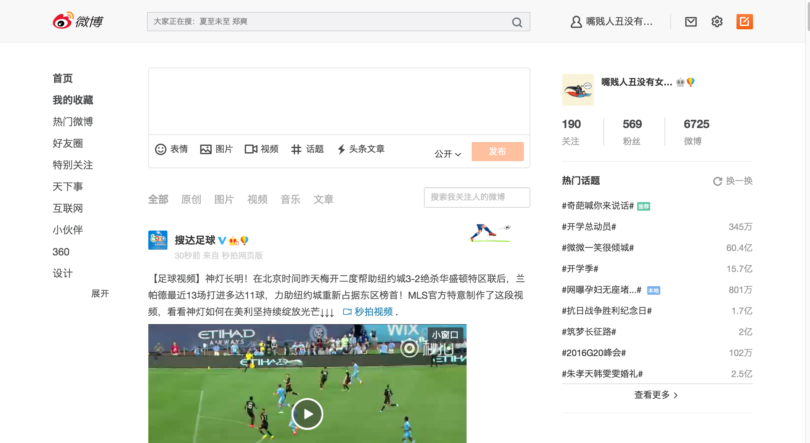

# WebpageSkin

在 Chrome 上使用 [Stylebot](https://chrome.google.com/webstore/detail/oiaejidbmkiecgbjeifoejpgmdaleoha) 来修改 CSS 给网页换肤，顺带屏蔽一些不想看的模块，或者广告。

### 详情

* font.css   将中文字符替换成微软雅黑，避免 iconfont 无法显示。

* weibo.css 基于 [BrainFlower](https://github.com/s0s0/BrainFlower/blob/master/weibo.css) 修改的微博皮肤，预览 ⬇️

   

